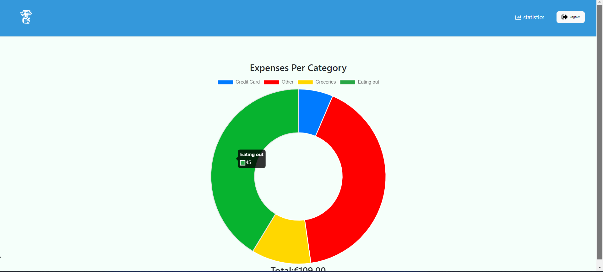
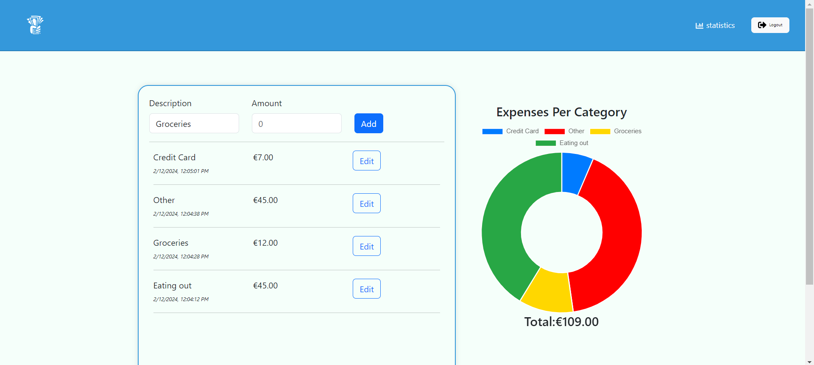

# Expense Tracker Website

This is an app that helps me track my expenses

## Table of contents

- [Expense Tracker Website](#expense-tracker-website)
  - [Table of contents](#table-of-contents)
  - [Overview](#overview)
    - [The challenge](#the-challenge)
    - [Screenshots](#screenshots)
    - [Links](#links)
    - [Built with](#built-with)
  - [Author](#author)

## Overview

### The challenge

Users should be able to:

- create an account with username, email and password or create or login with google
- create edit, delete and update expense
- view statistics of his or her expenses

### Screenshots

<

### Links

- Live Site URL: [Click Me !](https://fintrack-emmanueldonkor.vercel.app/)

### Built with

- React + vite + React-Boostrap + Redux-Toolkit
- Asp.net core 7
  

## Author
- LinkedIn- [EmmDonkor](https://www.linkedin.com/in/emmanueldonkor)

